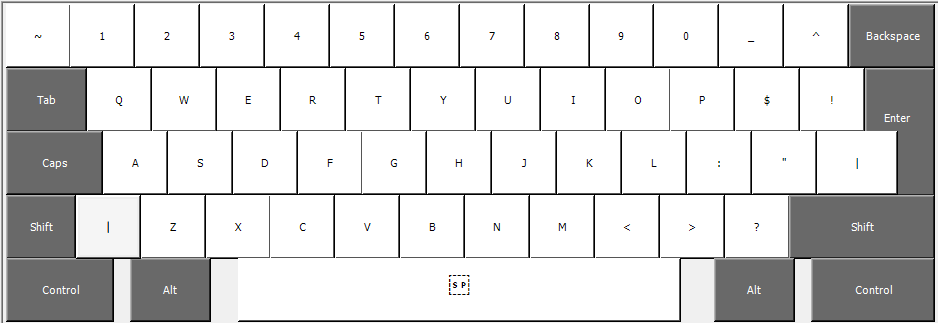

# The programmer QWERTY layout

The aim of this layout is to reduce strain on the ring finger and pinky and
shift it to the middle and index fingers.

The layout is constructed with special focus on `vim` shortcuts/motions while
remaining as close as possible to the default QWERTY layout.

There might be some ergonomy and/or speed benefits with other layouts but
QWERTY is the standard and it is fast enough. The main problem is that there's
too many symbols to be handled with the right hand's ring finger and pinky.

## V7

Base layer:

Shift layer:

